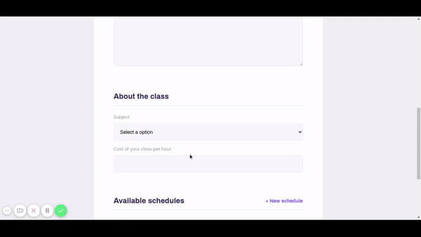

<p align="left">
   
</p>

# Proffy App

> Connection between students and professors, welcome to Proffy :)

[](https://github.com/jennifertakagi)
[](#)
[](https://github.com/jennifertakagi/proffy-app/stargazers)
[](https://github.com/jennifertakagi/proffy-app/network/members)
[](https://github.com/jennifertakagi/news-app-react/graphs/contributors)

---

# :pushpin: Table of Contents

* [Features](#rocket-features)
* [UI Documentation](#framed_picture-ui-documentation)
* [Installation](#construction_worker-installation)
* [Getting Started](#runner-getting-started)
* [FAQ](#postbox-faq)
* [Found a bug? Missing a specific feature?](#bug-issues)
* [Contributing](#tada-contributing)
* [License](#closed_book-license)

<br />

# :rocket: Features

* Register user as a teacher.
* Connect with teachers by whatsapp.
* Mobile app with favorite functionality.
* Connection with SQLite database.

# :framed_picture: UI Documentation
This project has a UI Documentation of reusable components, allowing to test them individually.

<p align="left">
   
</p>

# :construction_worker: Installation

**You need to install [Node.js](https://nodejs.org/en/download/) and [NPM](https://www.npmjs.com/) first, then in order to clone the project via HTTPS, run this command:**

```git clone https://github.com/jennifertakagi/proffy-app.git```

SSH URLs provide access to a Git repository via SSH, a secure protocol. If you have a SSH key registered in your Github account, clone the project using this command:

```git clone git@github.com:jennifertakagi/proffy-app.git```

**Enter in the project (web, mobile or server)**

```cd web|mobile|server```

**Install dependencies**

```npm install```

# :runner: Getting Started

Run the following command in order to start the application in a development environment:

```npm start```

# :postbox: Faq

**Question:** What are the tecnologies used in this project?

**Answer:** The tecnologies used in this project are [React JS](https://reactjs.org/docs/getting-started.html) + [React Native](https://reactnative.dev/) + [SQLite](https://www.sqlite.org/index.html).

# :bug: Issues

Feel free to **file a new issue** with a respective title and description on the [Proffy App](https://github.com/jennifertakagi/proffy-app/issues) repository. If you already found a solution to your problem, **i would love to review your pull request**! Have a look at our [contribution guidelines](https://github.com/jennifertakagi/proffy-app/blob/master/CONTRIBUTING.md) to find out about the coding standards.

# :tada: Contributing

Check out the [contributing](https://github.com/jennifertakagi/proffy-app/blob/master/CONTRIBUTING.md) page to see the best places to file issues, start discussions and begin contributing.

# :closed_book: License

Released in 2020 (Work in progress).
This project is under the [MIT license](https://github.com/jennifertakagi/proffy-app/master/LICENSE).
